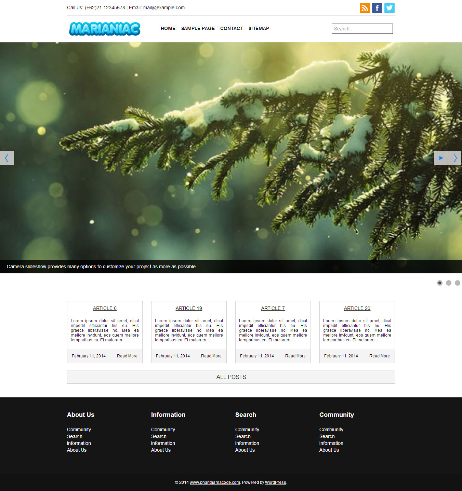

# Wordpress Theme - Marianiac

Marianiac Theme is Responsive Theme for Blog or Website ( Profile, Business and Corporate ).

How to Install it to your Wordpress Site:
* Extract zip Package.
* Rename it to phc-camera.
* Copy it into wp-content\themes.
* Goto Appearance > Themes.
* Click Activate on Mariani.

Features:
* Of Course it's easy to use.
* Responsive Theme using Bootstrap 2.3.2.
* Translation available ( welcome for contributor ).
* Theme Options Page to manage theme.
* Complete Documentation Page.

License:
* [GNU GPL](http://www.gnu.org/licenses/gpl-3.0.txt)

Credits:
* [Bootstrap 2.3.2](getbootstrap.com/2.3.2/getting-started.html)
* Inspire Site for this theme.

## Screenshot

